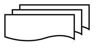

# Flowchart

* Definition: A visual diagram/shape with a flow in one or two directions, arranged sequentially
* Before building a program:
  Makes it easier for programmers to determine the program's logic flow
* After building a program:
  Explains the program's flow to other people

So, a flowchart is to represent the components found in a programming language

## Flowchart Symbols

| Symbol | Description |
|---|---|
|  | **Start/End (Terminator)** — marks the beginning or end of a flowchart |
|  | **Data Flow** — shows the direction of program flow |
|  | **Input/Output** — represents data entering or leaving the process |
|  | **Process** — a step, action, or calculation |
|  | **Decision (Percabangan)** — a branching point based on a condition |
|  | **Preparation** — assigns an initial value to a variable |
|  | **Call** — calls a procedure or function |
|  | **Connector** — links flow to another point on the same page |
|  | **Off-page Connector** — links flow to a different page |
|  | **Document** — represents a single document |
|  | **Multi-document** — represents multiple documents |
|  | **Hard Disk** — represents data stored on disk |