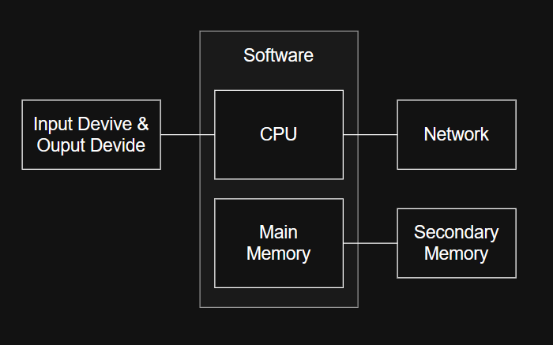

## Computer

* Definition: An electronic device that processes data according to a set of instructions to produce useful information.
* Function: Executes programs, performs calculations, stores, and retrieves data.
* Nature: Operates on binary (0 and 1)

##  Computer Architecture

* I/O Device: Computer Media of interaction for User
* CPU: Execute every command, event, and program
* Main Memory: A place where data will be used by CPU
* Secondary Memory: A place where heavy load of data is stored